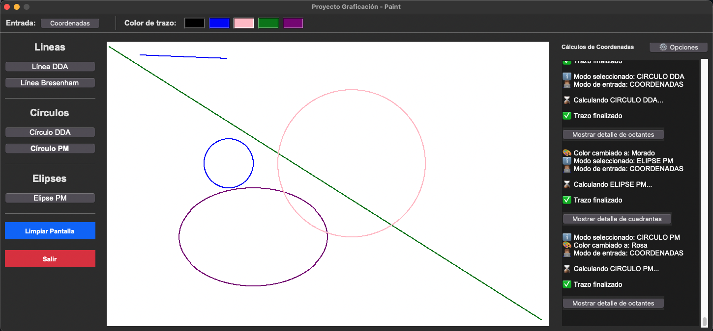
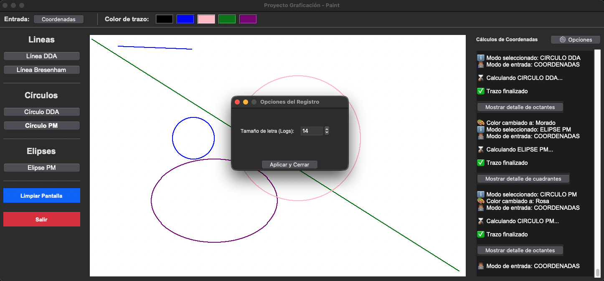
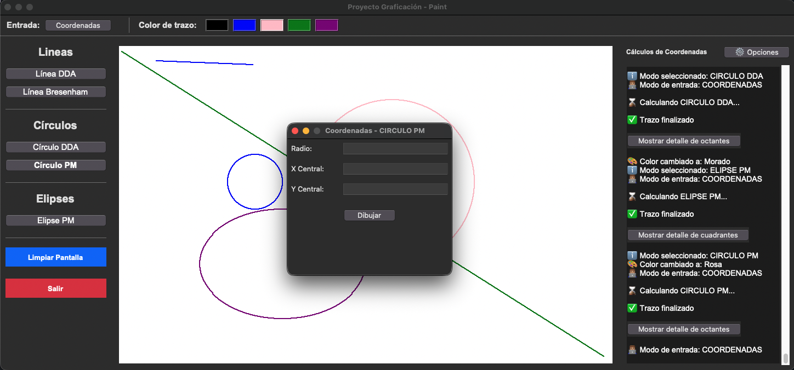
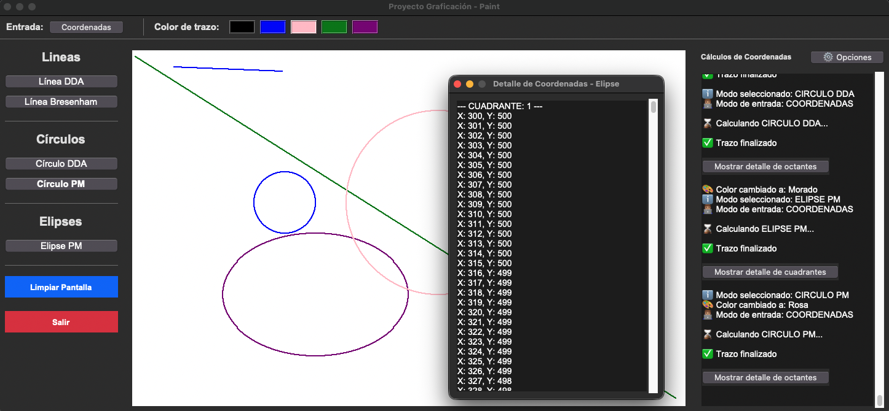

# Proyecto Final: Aplicación de Graficación por Computadora (Paint)

Este proyecto es una aplicación de escritorio desarrollada en Python utilizando Tkinter. Simula un programa de dibujo básico (estilo Paint) con el propósito de demostrar la implementación matemática pura de algoritmos fundamentales de graficación por computadora (rasterización de primitivas).

**Autor:** Fernando Soriano  
**Programa:** Ingeniería en Sistemas Computacionales
**Materia:** Graficación por Computadora (GPC)

---

## 🚀 Características Principales

El núcleo de la aplicación radica en que **no utiliza funciones nativas** del sistema para trazar figuras complejas; cada pixel es calculado y renderizado individualmente a través de clases matemáticas independientes.

- **Algoritmos Implementados:**
  - **Líneas:** DDA y Bresenham.
  - **Círculos:** DDA y Punto Medio (calculando 1 octante y aplicando simetría).
  - **Elipses:** Punto Medio.
  - **Parábolas:** Algoritmo de trazado de curvas.
- **Modos de Entrada:**
  - _Interactivo (Mouse):_ Permite definir puntos iniciales y finales directamente haciendo clic sobre el lienzo.
  - _Coordenadas (Formulario):_ Ventana modal para ingresar valores exactos (X, Y, Radio), ideal para circunferencias, elipses y parábolas.
- **Interfaz Dinámica (UX/UI):**
  - Panel de registro (log) en tiempo real para visualizar los cálculos paso a paso.
  - Sistema de opciones para ajustar el tamaño de fuente dinámicamente.
  - Ventanas de detalle independientes para visualizar las matrices de coordenadas generadas (ej. detalle de los 8 octantes de un círculo) sin saturar la vista principal.
- **Multiplataforma:** Optimizado para ejecutarse y mantener un diseño consistente tanto en macOS como en entornos Linux (ej. Fedora).

---

## 📂 Estructura del Proyecto

El proyecto sigue una arquitectura Modelo-Vista-Controlador (MVC) simplificada para separar la lógica matemática de la interfaz gráfica.

```text
proyecto_final/
├── main.py                 # Punto de entrada principal de la aplicación.
├── controllers/
│   └── app_controller.py   # Lógica de control, manejo de eventos (clics, botones) e instanciación de algoritmos.
├── ui/
│   └── canvas_manager.py   # Manejo directo del lienzo (canvas), dibujado de pixeles y limpieza de pantalla.
│   └── main_window.py      # Definición de la vista (Tkinter), menús, paleta de colores y lienzo.
└── algorithms/
    ├── circunferencias.py  # Clases DDA y Punto Medio para círculos.
    ├── elipse.py           # Clase con el algoritmo de Punto Medio para elipses.
    ├── lineas.py           # Clases con los algoritmos DDA y Bresenham para líneas.
    └── parabola.py         # Clase con el algoritmo para trazado de parábolas.
```

## 🛠️ Instrucciones de Ejecución

### Requisitos previos

- Tener **Python 3.x** instalado en el sistema.
- La librería **Tkinter** (por lo general, viene incluida por defecto en las instalaciones estándar de Python).

### Pasos para ejecutar

1.  Clona o descarga el repositorio en tu máquina local.
2.  Abre una terminal y navega hasta el directorio raíz del proyecto:
    ```bash
    cd ruta/hacia/proyecto_final
    ```
3.  Ejecuta el archivo principal:
    ```bash
    python3 main.py
    ```
    _(Nota: Dependiendo de tu entorno, el comando podría ser simplemente `python main.py`)_

### Uso básico

1.  Selecciona una herramienta (ej. "Línea Bresenham") en el panel izquierdo.
2.  Elige un color en la barra superior.
3.  Haz clic en el lienzo blanco para marcar el punto inicial (X1, Y1) y un segundo clic para el punto final (X2, Y2).
4.  Para trazos complejos (Círculos, Elipses, Parábolas), utiliza el botón **"Coordenadas"** en la parte superior izquierda.

## 📸 Capturas de Pantalla


_Vista general de la aplicación en ejecución, destacando el menú lateral de herramientas, la paleta de colores y el lienzo de dibujo._

---


_Ventana modal para ajustar dinámicamente el tamaño de letra de los textos._

---


_Formulario de entrada que permite al usuario definir con precisión matemática los parámetros necesarios (X, Y, Radio) para el trazado de circunferencias._

---


_Ventana de detalle independiente que despliega la matriz completa de píxeles generados por el algoritmo, organizada para su análisis sin saturar la interfaz principal._
